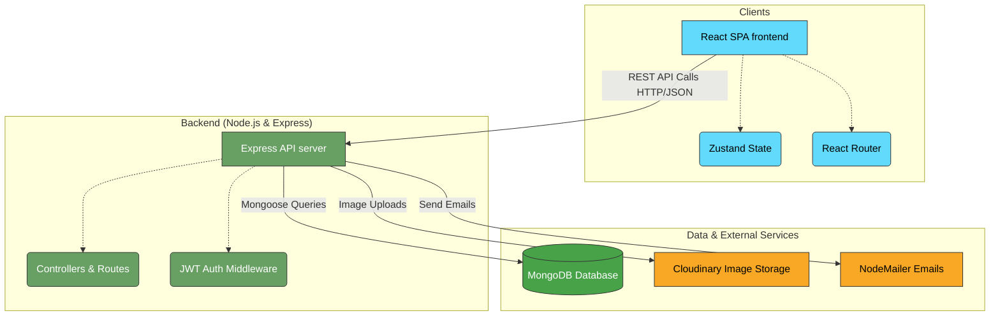

# Online Exam Platform

A comprehensive, multi-role SaaS platform where institutes (coaching centres, colleges) can create exams, enrol students, and view analytics. Students take timed, proctored exams and see their results. Built with the MERN stack (MongoDB, Express.js, React, Node.js).

## 🚀 Features

- **Multi-Role System**: Super Admin, Admin (Institute/Teacher), and Student roles.
- **Robust Exam Engine**:
  - Secure, timed exams with server-side time tracking.
  - **AI Proctoring Engine**: Client-side computer vision using TensorFlow.js & MediaPipe to detect multiple faces, missing faces, head turning (gaze tracking), and cell phones.
  - Basic Proctoring: Detects tab switching and fullscreen exits.
  - Automatic submission when the timer runs out.
  - Randomize questions and options.
- **Rich Question Bank**: Supports MCQ, MSQ, True/False, and Fill in the Blanks with rich text and image support.
- **Analytics & Reporting**: Detailed insights into average scores, pass rates, question accuracy, and more.
- **Modern User Interface**: Responsive, interactive UI designed with Tailwind CSS, shadcn/ui, and specialized design systems.

## 🏗 Architecture



## 🛠 Tech Stack

**Frontend**:

- React 18 (Vite)
- React Router v6
- Zustand (State Management)
- Tailwind CSS & shadcn/ui
- Recharts (Analytics)
- Quill.js (Rich Text Editor)
- TensorFlow.js & Google MediaPipe (Client-side AI Computer Vision)

**Backend**:

- Node.js & Express.js
- MongoDB & Mongoose
- JSON Web Tokens (Access + Refresh token rotation)
- NodeMailer (Email Services)
- Cloudinary & Multer (Image Uploads)
- bcryptjs, cors, helmet, express-validator

## 📁 Repository Structure

- `/frontend` - React application (Vite setup)
- `/server` - Express/Node.js backend API

## ⚙️ Getting Started

### Prerequisites

- Node.js (v18+ recommended)
- MongoDB (Local or Atlas Atlas URI)
- Cloudinary Account (for image uploads)

### 1. Backend Setup

1. Navigate to the server directory:
   ```bash
   cd server
   ```
2. Install dependencies:
   ```bash
   npm install
   ```
3. Set up environment variables:
   Copy `.env.example` to `.env` (or refer to the project's root `.env.example`) and fill in your details:
   ```env
   PORT=5000
   MONGO_URI=your_mongodb_uri
   JWT_ACCESS_SECRET=your_access_secret
   JWT_REFRESH_SECRET=your_refresh_secret
   CLIENT_URL=http://localhost:5173
   CLOUDINARY_CLOUD_NAME=your_cloudinary_name
   CLOUDINARY_API_KEY=your_cloudinary_key
   CLOUDINARY_API_SECRET=your_cloudinary_secret
   ```
4. Start the backend development server:
   ```bash
   npm run dev
   ```

### 2. Frontend Setup

1. Navigate to the frontend directory:
   ```bash
   cd frontend
   ```
2. Install dependencies:
   ```bash
   npm install
   ```
3. Start the frontend development server:
   ```bash
   npm run dev
   ```

The frontend will typically run on `http://localhost:5173`, and interface with the backend API on `http://localhost:5000`.

## 🚀 Deployment (Vercel)

This project contains a unified `vercel.json` meaning it is fully pre-configured to deploy easily to [Vercel](https://vercel.com).

1. Import your repository into Vercel.
2. In the setup screen, leave the **Root Directory** as the repository root.
3. Don't select a framework preset (leave it default or "Other"). Vercel will automatically read the `vercel.json` file.
4. Supply your `.env` variables in the **Environment Variables** deployment settings.
5. Hit **Deploy**. The unified build uses `@vercel/static-build` for your React frontend and `@vercel/node` for your Express backend API.

*Note: The `server/index.js` automatically detects production and exports the app as serverless functions, bypassing fixed TCP port bindings.*

## 👥 Usage / Roles

1. **Super Admin**: Manages global system settings, onboard institutes, and manages subscriptions.
2. **Admin (Teacher)**: Creates exams, manages the question bank, enrolls students, and views detailed exam analytics.
3. **Student**: Logs in to view upcoming exams, takes exams in a secure proctored UI, and views their results post-exam.

## 📜 License

This project is proprietary and confidential.
